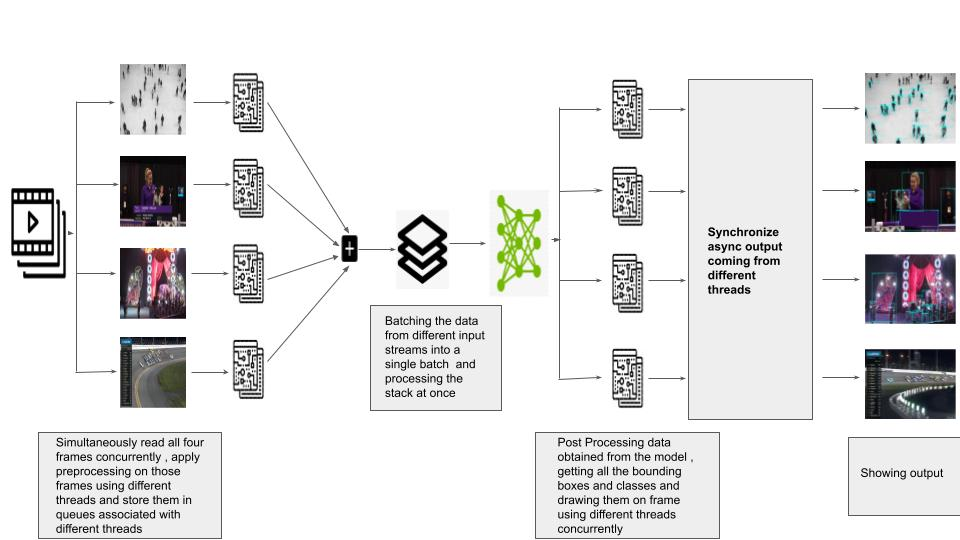

# Multi-Video Processing

>This is a POC to show how NVIDIA DEEPSTREAM SDK / TRITON Inference server works in the background.

## Installation for running demo:

##### 1.Install GPU Drivers : https://nvidia.custhelp.com/app/answers/detail/a_id/2900/~/installing-nvidia-display-drivers-under-windows-7%2C-windows-8%2C-or-windows-10
##### 2.Install Cuda Toolkit 10.1 : https://developer.nvidia.com/cuda-10.1-download-archive-base?target_os=Windows&target_arch=x86_64&target_version=10&target_type=exelocal
##### 3.Install Cudnn : https://developer.nvidia.com/compute/machine-learning/cudnn/secure/8.0.5/10.1_20201106/cudnn-10.1-windows10-x64-v8.0.5.39.zip
##### 4.cd into project directory
##### 5.pip install -r requirements.txt
##### 6.Install pytorch : pip3 install torch==1.7.1+cu101 torchvision==0.8.1+cu101 -f https://download.pytorch.org/whl/torch_stable.html

## Installation for running demo on Linux:

##### 1.Install GPU Drivers : https://www.cyberciti.biz/faq/ubuntu-linux-install-nvidia-driver-latest-proprietary-driver/
##### 2.Install Cuda Toolkit 10.1 : https://docs.nvidia.com/cuda/cuda-installation-guide-linux/index.html
##### 3.Install Cudnn : https://developer.nvidia.com/rdp/cudnn-archive
##### 4.cd into project directory
##### 5.pip3 install -r requirements.txt
##### 6.Install pytorch : pip3 install torch==1.7.1+cu101 torchvision==0.8.1+cu101 -f https://download.pytorch.org/whl/torch_stable.html

# Pipeline for Multiple Video Inferencing with batch size of 4

  

## Some insights:

```
1.Run python “demo(4 video).py” for running the demo for 4 videos simultaneously, the demo
has Inference Request of 1 and Batch of 4 images from different input streams .
```

```
2.Run python “demo(1 video).py” for running the demo for 1 video with Inference Request of 1
and Batch of 1 image , you can run this just for comparison
with the main pipeline mentioned above.
```

```
3.Run python “demo(IR=2).py” for running the demo with 4 videos simultaneously. The demo
has Inference Request of 2 and a batch of 2 images from different input streams at
once.
```
# RESULTS (On my Poor system BTW) : 
## 1 Video inference with single model request and batch size of 1(demo(4 video).py) -  10 FPS 
## 4 Video inference with single model request and batch size of 4(demo(1 video).py) - 10 FPS 
## 4 Video inference with 2 model requests and batch size of 2 on single model request(demo(IR=2).py) - 8 FPS
